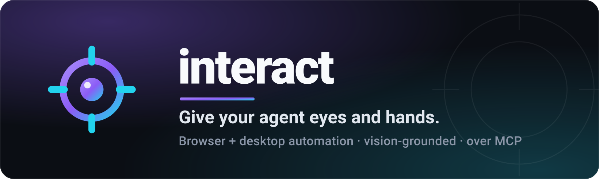
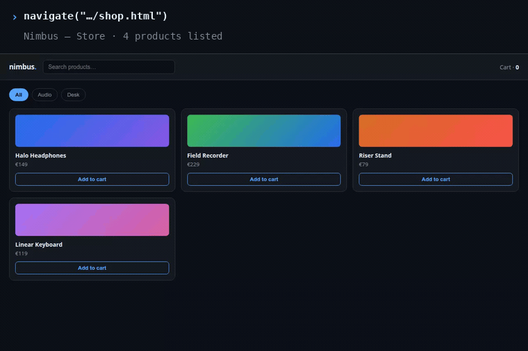
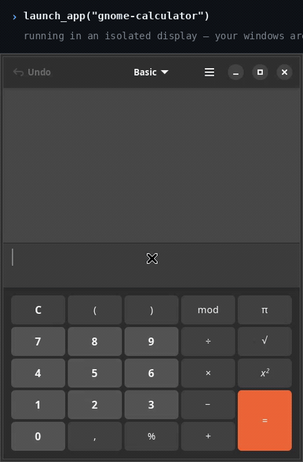

<p align="center">
  <a href="https://alanblanchet.github.io/interact/">
    
  </a>
</p>

<p align="center">
  <b>Browser <i>and</i> desktop automation for AI agents — over MCP.</b><br>
  Vision-grounded control that reports <b>what changed</b>, not a screenshot.
</p>

<p align="center">
  <a href="https://alanblanchet.github.io/interact/"><b>🌐 Website</b></a> ·
  <a href="#60-second-quickstart">Quickstart</a> ·
  <a href="#ask-your-agent">Examples</a> ·
  <a href="#what-your-agent-can-do">Capabilities</a>
</p>

<p align="center">
  <a href="https://github.com/AlanBlanchet/interact/actions/workflows/ci.yml"></a>
  <a href="LICENSE"></a>
  <a href="https://www.python.org/"></a>
  <a href="https://modelcontextprotocol.io/"></a>
</p>

---

## See it work

Your agent clicks a filter, types a search, adds to a cart. Each caption is the tool call that ran
and the text that came back — that text is all your model sees.

<p align="center"></p>

The same tools drive a **real desktop app** — `launch_app` puts it in an isolated display the agent owns.

<p align="center"></p>

## 60-second quickstart

```bash
# 1. install the `interact` command (installs uv if missing)
curl -LsSf https://raw.githubusercontent.com/AlanBlanchet/interact/main/install.sh | sh

# 2. register it with your agent
interact install claude     # or: cursor · vscode · copilot · codex · windsurf · zed · claude-desktop

# 3. check keys, providers, browser, desktop
interact doctor
```

That's it — your agent can now navigate, click, type, scroll, drag, see, hear and watch.

<details>
<summary>Other install routes (Windows, no-install, VS Code)</summary>

```bash
uv tool install git+https://github.com/AlanBlanchet/interact             # any platform, incl. Windows
uvx --from git+https://github.com/AlanBlanchet/interact interact mcp     # run without installing
```

interact isn't on PyPI — the bare name is taken there. `interact install vscode` registers the server
with Copilot's agent mode; no extension needed.
</details>

## Ask your agent

Plain English in, real actions out. Nothing to script — these are prompts you type to your agent.

> **"Open the store on localhost:3000, filter to Audio, add the field recorder to the cart and tell me the cart count."**
> `navigate` opens the page, then one `run_actions` batches the clicks and typing — each step reporting what changed. *(This is the browser demo above.)*

> **"Launch gnome-calculator in the sandbox and work out 7 × 6."**
> `launch_app` starts it on a display the agent owns; `run_actions` with `target="nested:Calculator"` presses the keys and reads the result back. *(This is the desktop demo above.)*

> **"Review the checkout page for visual defects, then confirm the nav has 4 tabs."**
> `review_ui` returns a severity-sorted critique, `verify_ui` answers PASS/FAIL per requirement, and `measure_ui` backs it with an exact WCAG contrast ratio — no model call, no spend.

## What your agent can do

One tool per job. The generic ones take a `target` — unset for the browser, a window title, `screen`,
`nested:<title>` for the sandbox, or `file:<path>` to analyse an image you already have.

| Tool | What it does |
| --- | --- |
| `run_actions` | The workhorse — click, type, scroll, drag, key-press, `evaluate_js`, batched in one call, each step reporting what changed. |
| `navigate` | Open a URL; returns title + visible text, or a vision answer with `query`. |
| `screenshot` | Capture a page, window or screen. Add `query` for an interpretation, `return_image` for raw pixels. |
| `get_interactive_elements` | List what's clickable as numbered `ref`s — DOM scan in the browser, vision / AT-SPI on the desktop. |
| `get_page_state` | URL, title, accessibility tree, visible text and the `ref` list. No model call. |
| `review_ui` | Find defects — a severity-sorted critique (contrast, overflow, truncation, misalignment). Pass a `reference` image to judge how a build diverges from a target. |
| `verify_ui` | Accept against your checklist — one PASS / FAIL / UNCLEAR per literal requirement, each naming the element judged. |
| `measure_ui` | Measure deterministically — exact WCAG contrast with AA/AAA, dominant colours, largest uniform band. No VLM, no spend. |
| `record` | Record a browser or desktop interaction to video, then `query` the video model about the sequence. |
| `transcribe` | Hear a local audio *or* video file — transcript back, or `query` it about the sound. |
| `launch_app` · `reset_sandbox` | Run an app in an isolated display the agent owns; tear it down again. |
| `list_desktop_windows` | List drivable targets — monitors, open windows, sandbox windows. |
| `session` · `get_logs` · `download_asset` | Browser session lifecycle, network / console logs, authenticated downloads. |
| `list_providers` · `report_issue` | What's configured, and file a bug or idea straight to the maintainers. |

### Models and keys

Run `interact` with no arguments for a terminal UI to set models and API keys. Models default to
**auto** — a capable, cheaper-first pick per job from the providers you have keys for, falling back if
one errors. `interact status` prints what each role resolves to and what you've spent; settings live
in `~/.interact/config.env`.

## Platform support

| | Linux | macOS | Windows |
| --- | :-: | :-: | :-: |
| Browser, MCP server, CLI, TUI | ✅ | ✅ | ✅ |
| Desktop control (real windows) | ✅ (X11; uinput input also on Wayland) | ⏳ | ⏳ |

Browser automation works everywhere. Native desktop control is Linux/X11 today; off Linux the desktop
tools return one clear message pointing you at the browser target — macOS/Windows backends are tracked
in [#24](https://github.com/AlanBlanchet/interact/issues/24). Known X11 limits, all under
[#1](https://github.com/AlanBlanchet/interact/issues/1): GPU-rendered windows (emulators, games) grab
black without a compositor — interact says so rather than handing back a black image; a software-GL blur
can composite to a solid strip; transient popups need `target="nested"` to capture the whole sandbox.

## Development

```bash
git clone https://github.com/AlanBlanchet/interact && cd interact
uv sync
uv run pytest -m "not integration"      # fast, cross-platform suite
uv tool install --force --editable .    # put your checkout's `interact` on PATH
```

CI runs the suite on Linux/macOS/Windows plus a sandboxed Linux desktop job; on push to `main` it tags
and publishes the release from `pyproject.toml`'s version (see [RELEASING.md](RELEASING.md)).

## Contributing

Issues and PRs welcome. Please add a failing test for a bug before fixing it, keep the suite green
(`uv run pytest -m "not integration"`), and note user-facing changes in [CHANGELOG.md](CHANGELOG.md).

## License

[MIT](LICENSE) © Alan Blanchet
